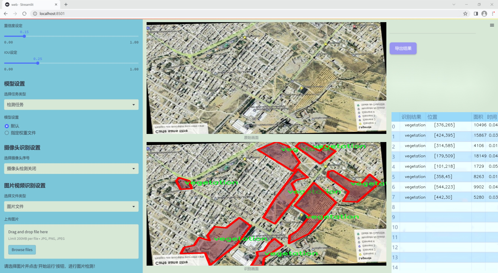
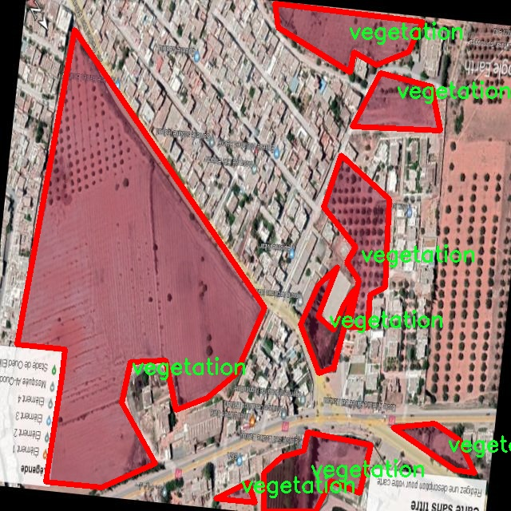

### 1.背景意义

研究背景与意义

随着全球气候变化和城市化进程的加速，城市绿化的重要性愈发凸显。绿化不仅能够改善城市的生态环境，还能有效降低城市热岛效应，提高居民的生活质量。因此，准确评估城市绿化率成为城市规划和环境管理中的一项重要任务。传统的绿化率评估方法多依赖于人工调查和地面测量，耗时耗力且易受主观因素影响，难以获得全面、准确的数据支持。近年来，遥感技术的快速发展为城市绿化监测提供了新的解决方案，通过航拍图像和先进的图像处理技术，可以实现对大范围区域的快速、准确评估。

在这一背景下，基于改进YOLOv11的遥感航拍植被区域图像分割系统应运而生。YOLO（You Only Look Once）系列模型因其高效的实时目标检测能力而受到广泛关注。通过对YOLOv11进行改进，我们能够更好地适应遥感图像的特征，提升植被区域的检测精度和分割效果。本研究所使用的数据集包含751幅经过精细标注的植被图像，涵盖了丰富的植被特征，为模型的训练和验证提供了坚实的基础。

本项目的实施不仅能够为城市绿化率的评估提供一种高效、自动化的解决方案，还能为后续的城市生态环境监测和管理提供重要的数据支持。通过对植被区域的精确分割，我们能够更好地理解城市绿化的现状及其变化趋势，为政策制定者提供科学依据，促进可持续城市发展。因此，基于改进YOLOv11的遥感航拍植被区域图像分割系统的研究具有重要的理论意义和实际应用价值。

### 2.视频效果

[2.1 视频效果](https://www.bilibili.com/video/BV1kYm8YUEiM/)

### 3.图片效果





##### [项目涉及的源码数据来源链接](https://kdocs.cn/l/cszuIiCKVNis)**

注意：本项目提供训练的数据集和训练教程,由于版本持续更新,暂不提供权重文件（best.pt）,请按照6.训练教程进行训练后实现上图演示的效果。

### 4.数据集信息

##### 4.1 本项目数据集类别数＆类别名

nc: 1
names: ['vegetation']


该项目为【图像分割】数据集，请在【训练教程和Web端加载模型教程（第三步）】这一步的时候按照【图像分割】部分的教程来训练

##### 4.2 本项目数据集信息介绍

本项目数据集信息介绍

本项目旨在改进YOLOv11模型，以实现高效的绿化率遥感航拍植被区域图像分割系统。为此，我们构建了一个专门针对植被检测的高质量数据集。该数据集的主题围绕“vegetation detection”，专注于识别和分割航拍图像中的植被区域。数据集中包含的类别数量为1，具体类别为“vegetation”，这意味着所有的标注和训练样本均聚焦于植被的识别与分析。

在数据集的构建过程中，我们综合考虑了多种因素，以确保其适应性和实用性。首先，数据集中的图像来源于不同的地理区域和气候条件，涵盖了多样化的植被类型，包括森林、草地、灌木丛等。这种多样性不仅增强了模型的泛化能力，还使其能够在不同环境下表现出色。其次，数据集中的图像经过精心标注，确保每一幅图像中的植被区域都被准确地框定。这一过程采用了高标准的标注流程，以减少误差和提高数据的可靠性。

此外，数据集还考虑到了不同光照条件和季节变化对植被识别的影响。通过收集在不同时间段拍摄的图像，我们能够训练出一个更加鲁棒的模型，能够在各种环境条件下有效地进行植被检测。这一数据集的构建不仅为YOLOv11模型的训练提供了坚实的基础，也为后续的研究和应用提供了宝贵的数据资源，推动了遥感技术在生态监测和环境保护领域的应用进程。通过对该数据集的深入研究与应用，我们期望能够实现更高精度的植被检测，进而为绿化率的评估和生态环境的改善提供有力支持。




### 5.全套项目环境部署视频教程（零基础手把手教学）

[5.1 所需软件PyCharm和Anaconda安装教程（第一步）](https://www.bilibili.com/video/BV1BoC1YCEKi/?spm_id_from=333.999.0.0&vd_source=bc9aec86d164b67a7004b996143742dc)


[5.2 安装Python虚拟环境创建和依赖库安装视频教程（第二步）](https://www.bilibili.com/video/BV1ZoC1YCEBw?spm_id_from=333.788.videopod.sections&vd_source=bc9aec86d164b67a7004b996143742dc)

### 6.改进YOLOv11训练教程和Web_UI前端加载模型教程（零基础手把手教学）

[6.1 改进YOLOv11训练教程和Web_UI前端加载模型教程（第三步）](https://www.bilibili.com/video/BV1BoC1YCEhR?spm_id_from=333.788.videopod.sections&vd_source=bc9aec86d164b67a7004b996143742dc)


按照上面的训练视频教程链接加载项目提供的数据集，运行train.py即可开始训练



     Epoch   gpu_mem       box       obj       cls    labels  img_size
     1/200     20.8G   0.01576   0.01955  0.007536        22      1280: 100%|██████████| 849/849 [14:42<00:00,  1.04s/it]
               Class     Images     Labels          P          R     mAP@.5 mAP@.5:.95: 100%|██████████| 213/213 [01:14<00:00,  2.87it/s]
                 all       3395      17314      0.994      0.957      0.0957      0.0843

     Epoch   gpu_mem       box       obj       cls    labels  img_size
     2/200     20.8G   0.01578   0.01923  0.007006        22      1280: 100%|██████████| 849/849 [14:44<00:00,  1.04s/it]
               Class     Images     Labels          P          R     mAP@.5 mAP@.5:.95: 100%|██████████| 213/213 [01:12<00:00,  2.95it/s]
                 all       3395      17314      0.996      0.956      0.0957      0.0845

     Epoch   gpu_mem       box       obj       cls    labels  img_size
     3/200     20.8G   0.01561    0.0191  0.006895        27      1280: 100%|██████████| 849/849 [10:56<00:00,  1.29it/s]
               Class     Images     Labels          P          R     mAP@.5 mAP@.5:.95: 100%|███████   | 187/213 [00:52<00:00,  4.04it/s]
                 all       3395      17314      0.996      0.957      0.0957      0.0845


###### [项目数据集下载链接](https://kdocs.cn/l/cszuIiCKVNis)

### 7.原始YOLOv11算法讲解

##### YOLO11简介

> YOLO11源码地址：https://github.com/ultralytics/ultralytics

Ultralytics
YOLO11是一款尖端的、最先进的模型，它在之前YOLO版本成功的基础上进行了构建，并引入了新功能和改进，以进一步提升性能和灵活性。YOLO11设计快速、准确且易于使用，使其成为各种物体检测和跟踪、实例分割、图像分类以及姿态估计任务的绝佳选择。  


**YOLO11创新点如下:**

YOLO 11主要改进包括：  
`增强的特征提取`：YOLO 11采用了改进的骨干和颈部架构，增强了特征提取功能，以实现更精确的目标检测。  
`优化的效率和速度`：优化的架构设计和优化的训练管道提供更快的处理速度，同时保持准确性和性能之间的平衡。  
`更高的精度，更少的参数`：YOLO11m在COCO数据集上实现了更高的平均精度（mAP），参数比YOLOv8m少22%，使其在不影响精度的情况下提高了计算效率。  
`跨环境的适应性`：YOLO 11可以部署在各种环境中，包括边缘设备、云平台和支持NVIDIA GPU的系统。  
`广泛的支持任务`：YOLO 11支持各种计算机视觉任务，如对象检测、实例分割、图像分类、姿态估计和面向对象检测（OBB）。

**YOLO11不同模型尺寸信息：**

YOLO11 提供5种不同的型号规模模型，以满足不同的应用需求：

Model| size (pixels)| mAPval 50-95| Speed CPU ONNX (ms)| Speed T4 TensorRT10
(ms)| params (M)| FLOPs (B)  
---|---|---|---|---|---|---  
YOLO11n| 640| 39.5| 56.1 ± 0.8| 1.5 ± 0.0| 2.6| 6.5  
YOLO11s| 640| 47.0| 90.0 ± 1.2| 2.5 ± 0.0| 9.4| 21.5  
YOLO11m| 640| 51.5| 183.2 ± 2.0| 4.7 ± 0.1| 20.1| 68.0  
YOLO11l| 640| 53.4| 238.6 ± 1.4| 6.2 ± 0.1| 25.3| 86.9  
YOLO11x| 640| 54.7| 462.8 ± 6.7| 11.3 ± 0.2| 56.9| 194.9  
  
**模型常用训练超参数参数说明：**  
`YOLOv11
模型的训练设置包括训练过程中使用的各种超参数和配置`。这些设置会影响模型的性能、速度和准确性。关键的训练设置包括批量大小、学习率、动量和权重衰减。此外，优化器、损失函数和训练数据集组成的选择也会影响训练过程。对这些设置进行仔细的调整和实验对于优化性能至关重要。  
**以下是一些常用的模型训练参数和说明：**

参数名| 默认值| 说明  
---|---|---  
`model`| `None`| 指定用于训练的模型文件。接受指向 `.pt` 预训练模型或 `.yaml`
配置文件。对于定义模型结构或初始化权重至关重要。  
`data`| `None`| 数据集配置文件的路径（例如
`coco8.yaml`).该文件包含特定于数据集的参数，包括训练数据和验证数据的路径、类名和类数。  
`epochs`| `100`| 训练总轮数。每个epoch代表对整个数据集进行一次完整的训练。调整该值会影响训练时间和模型性能。  
`patience`| `100`| 在验证指标没有改善的情况下，提前停止训练所需的epoch数。当性能趋于平稳时停止训练，有助于防止过度拟合。  
`batch`| `16`| 批量大小，有三种模式:设置为整数(例如，’ Batch =16 ‘)， 60% GPU内存利用率的自动模式(’ Batch
=-1 ‘)，或指定利用率分数的自动模式(’ Batch =0.70 ')。  
`imgsz`| `640`| 用于训练的目标图像尺寸。所有图像在输入模型前都会被调整到这一尺寸。影响模型精度和计算复杂度。  
`device`| `None`| 指定用于训练的计算设备：单个 GPU (`device=0`）、多个 GPU (`device=0,1`)、CPU
(`device=cpu`)，或苹果芯片的 MPS (`device=mps`).  
`workers`| `8`| 加载数据的工作线程数（每 `RANK` 多 GPU 训练）。影响数据预处理和输入模型的速度，尤其适用于多 GPU 设置。  
`name`| `None`| 训练运行的名称。用于在项目文件夹内创建一个子目录，用于存储训练日志和输出结果。  
`pretrained`| `True`| 决定是否从预处理模型开始训练。可以是布尔值，也可以是加载权重的特定模型的字符串路径。提高训练效率和模型性能。  
`optimizer`| `'auto'`| 为训练模型选择优化器。选项包括 `SGD`, `Adam`, `AdamW`, `NAdam`,
`RAdam`, `RMSProp` 等，或 `auto` 用于根据模型配置进行自动选择。影响收敛速度和稳定性  
`lr0`| `0.01`| 初始学习率（即 `SGD=1E-2`, `Adam=1E-3`) .调整这个值对优化过程至关重要，会影响模型权重的更新速度。  
`lrf`| `0.01`| 最终学习率占初始学习率的百分比 = (`lr0 * lrf`)，与调度程序结合使用，随着时间的推移调整学习率。  


**各损失函数作用说明：**  
`定位损失box_loss`：预测框与标定框之间的误差（GIoU），越小定位得越准；  
`分类损失cls_loss`：计算锚框与对应的标定分类是否正确，越小分类得越准；  
`动态特征损失（dfl_loss）`：DFLLoss是一种用于回归预测框与目标框之间距离的损失函数。在计算损失时，目标框需要缩放到特征图尺度，即除以相应的stride，并与预测的边界框计算Ciou
Loss，同时与预测的anchors中心点到各边的距离计算回归DFLLoss。  


### 8.200+种全套改进YOLOV11创新点原理讲解

#### 8.1 200+种全套改进YOLOV11创新点原理讲解大全

由于篇幅限制，每个创新点的具体原理讲解就不全部展开，具体见下列网址中的改进模块对应项目的技术原理博客网址【Blog】（创新点均为模块化搭建，原理适配YOLOv5~YOLOv11等各种版本）

[改进模块技术原理博客【Blog】网址链接](https://gitee.com/qunmasj/good)


#### 8.2 精选部分改进YOLOV11创新点原理讲解

###### 这里节选部分改进创新点展开原理讲解(完整的改进原理见上图和[改进模块技术原理博客链接](https://gitee.com/qunmasj/good)【如果此小节的图加载失败可以通过CSDN或者Github搜索该博客的标题访问原始博客，原始博客图片显示正常】

### Gold-YOLO简介
YOLO再升级：华为诺亚提出Gold-YOLO，聚集-分发机制打造新SOTA
在过去的几年中，YOLO系列模型已经成为实时目标检测领域的领先方法。许多研究通过修改架构、增加数据和设计新的损失函数，将基线推向了更高的水平。然而以前的模型仍然存在信息融合问题，尽管特征金字塔网络（FPN）和路径聚合网络（PANet）已经在一定程度上缓解了这个问题。因此，本研究提出了一种先进的聚集和分发机制（GD机制），该机制通过卷积和自注意力操作实现。这种新设计的模型被称为Gold-YOLO，它提升了多尺度特征融合能力，在所有模型尺度上实现了延迟和准确性的理想平衡。此外，本文首次在YOLO系列中实现了MAE风格的预训练，使得YOLO系列模型能够从无监督预训练中受益。Gold-YOLO-N在COCO val2017数据集上实现了出色的39.9% AP，并在T4 GPU上实现了1030 FPS，超过了之前的SOTA模型YOLOv6-3.0-N，其FPS相似，但性能提升了2.4%。


#### Gold-YOLO


YOLO系列的中间层结构采用了传统的FPN结构，其中包含多个分支用于多尺度特征融合。然而，它只充分融合来自相邻级别的特征，对于其他层次的信息只能间接地进行“递归”获取。

传统的FPN结构在信息传输过程中存在丢失大量信息的问题。这是因为层之间的信息交互仅限于中间层选择的信息，未被选择的信息在传输过程中被丢弃。这种情况导致某个Level的信息只能充分辅助相邻层，而对其他全局层的帮助较弱。因此，整体上信息融合的有效性可能受到限制。
为了避免在传输过程中丢失信息，本文采用了一种新颖的“聚集和分发”机制（GD），放弃了原始的递归方法。该机制使用一个统一的模块来收集和融合所有Level的信息，并将其分发到不同的Level。通过这种方式，作者不仅避免了传统FPN结构固有的信息丢失问题，还增强了中间层的部分信息融合能力，而且并没有显著增加延迟。


# 8.低阶聚合和分发分支 Low-stage gather-and-distribute branch
从主干网络中选择输出的B2、B3、B4、B5特征进行融合，以获取保留小目标信息的高分辨率特征。


低阶特征对齐模块 (Low-stage feature alignment module)： 在低阶特征对齐模块（Low-FAM）中，采用平均池化（AvgPool）操作对输入特征进行下采样，以实现统一的大小。通过将特征调整为组中最小的特征大小（ R B 4 = 1 / 4 R ） （R_{B4} = 1/4R）（R 
B4 =1/4R），我们得到对齐后的特征F a l i g n F_{align}F align 。低阶特征对齐技术确保了信息的高效聚合，同时通过变换器模块来最小化后续处理的计算复杂性。其中选择 R B 4 R_{B4}R B4 作为特征对齐的目标大小主要基于保留更多的低层信息的同时不会带来较大的计算延迟。
低阶信息融合模块(Low-stage information fusion module)： 低阶信息融合模块（Low-IFM）设计包括多层重新参数化卷积块（RepBlock）和分裂操作。具体而言，RepBlock以F a l i g n ( c h a n n e l = s u m ( C B 2 ， C B 3 ， C B 4 ， C B 5 ) ) F_{align} (channel= sum(C_{B2}，C_{B3}，C_{B4}，C_{B5}))F align (channel=sum(C B2 ，C B3 ，C B4 ，C B5 )作为输入，并生成F f u s e ( c h a n n e l = C B 4 + C B 5 ) F_{fuse} (channel= C_{B4} + C_{B5})F fuse (channel=C B4 +C B5 )。其中中间通道是一个可调整的值（例如256），以适应不同的模型大小。由RepBlock生成的特征随后在通道维度上分裂为F i n j P 3 Finj_P3Finj P 3和F i n j P 4 Finj_P4Finj P 4，然后与不同级别的特征进行融合。


# 8.高阶聚合和分发分支 High-stage gather-and-distribute branch
高级全局特征对齐模块（High-GD）将由低级全局特征对齐模块（Low-GD）生成的特征{P3, P4, P5}进行融合。


高级特征对齐模块(High-stage feature alignment module)： High-FAM由avgpool组成，用于将输入特征的维度减小到统一的尺寸。具体而言，当输入特征的尺寸为{R P 3 R_{P3}R P3 , R P 4 R_{P4}R P4 , R P 5 R_{P 5}R P5 }时，avgpool将特征尺寸减小到该特征组中最小的尺寸（R P 5 R_{P5}R P5  = 1/8R）。由于transformer模块提取了高层次的信息，池化操作有助于信息聚合，同时降低了transformer模块后续步骤的计算需求。

Transformer融合模块由多个堆叠的transformer组成，transformer块的数量为L。每个transformer块包括一个多头注意力块、一个前馈网络（FFN）和残差连接。采用与LeViT相同的设置来配置多头注意力块，使用16个通道作为键K和查询Q的头维度，32个通道作为值V的头维度。为了加速推理过程，将层归一化操作替换为批归一化，并将所有的GELU激活函数替换为ReLU。为了增强变换器块的局部连接，在两个1x1卷积层之间添加了一个深度卷积层。同时，将FFN的扩展因子设置为2，以在速度和计算成本之间取得平衡。

信息注入模块(Information injection module)： 高级全局特征对齐模块（High-GD）中的信息注入模块与低级全局特征对齐模块（Low-GD）中的相同。在高级阶段，局部特征（Flocal）等于Pi，因此公式如下所示：


### 增强的跨层信息流动 Enhanced cross-layer information flow
为了进一步提升性能，从YOLOv11 中的PAFPN模块中得到启发，引入了Inject-LAF模块。该模块是注入模块的增强版，包括了一个轻量级相邻层融合（LAF）模块，该模块被添加到注入模块的输入位置。为了在速度和准确性之间取得平衡，设计了两个LAF模型：LAF低级模型和LAF高级模型，分别用于低级注入（合并相邻两层的特征）和高级注入（合并相邻一层的特征）。它们的结构如图5(b)所示。为了确保来自不同层级的特征图与目标大小对齐，在实现中的两个LAF模型仅使用了三个操作符：双线性插值（上采样过小的特征）、平均池化（下采样过大的特征）和1x1卷积（调整与目标通道不同的特征）。模型中的LAF模块与信息注入模块的结合有效地平衡了准确性和速度之间的关系。通过使用简化的操作，能够增加不同层级之间的信息流路径数量，从而提高性能而不显著增加延迟。


### 9.系统功能展示

图9.1.系统支持检测结果表格显示

  图9.2.系统支持置信度和IOU阈值手动调节

  图9.3.系统支持自定义加载权重文件best.pt(需要你通过步骤5中训练获得)

  图9.4.系统支持摄像头实时识别

  图9.5.系统支持图片识别

  图9.6.系统支持视频识别

  图9.7.系统支持识别结果文件自动保存

  图9.8.系统支持Excel导出检测结果数据


### 10. YOLOv11核心改进源码讲解

#### 10.1 kacn_conv.py

以下是经过简化和注释的核心代码部分，保留了最重要的功能和结构：

```python
import torch
import torch.nn as nn

class KACNConvNDLayer(nn.Module):
    def __init__(self, conv_class, norm_class, input_dim, output_dim, degree, kernel_size,
                 groups=1, padding=0, stride=1, dilation=1,
                 ndim: int = 2, dropout=0.0):
        super(KACNConvNDLayer, self).__init__()
        
        # 初始化参数
        self.inputdim = input_dim  # 输入维度
        self.outdim = output_dim    # 输出维度
        self.degree = degree         # 多项式的阶数
        self.kernel_size = kernel_size  # 卷积核大小
        self.padding = padding       # 填充
        self.stride = stride         # 步幅
        self.dilation = dilation     # 膨胀
        self.groups = groups         # 分组卷积的组数
        self.ndim = ndim             # 数据的维度（1D, 2D, 3D）
        
        # 初始化 dropout
        self.dropout = None
        if dropout > 0:
            if ndim == 1:
                self.dropout = nn.Dropout1d(p=dropout)
            elif ndim == 2:
                self.dropout = nn.Dropout2d(p=dropout)
            elif ndim == 3:
                self.dropout = nn.Dropout3d(p=dropout)

        # 检查分组参数的有效性
        if groups <= 0:
            raise ValueError('groups must be a positive integer')
        if input_dim % groups != 0:
            raise ValueError('input_dim must be divisible by groups')
        if output_dim % groups != 0:
            raise ValueError('output_dim must be divisible by groups')

        # 初始化层归一化和多项式卷积层
        self.layer_norm = nn.ModuleList([norm_class(output_dim // groups) for _ in range(groups)])
        self.poly_conv = nn.ModuleList([conv_class((degree + 1) * input_dim // groups,
                                                   output_dim // groups,
                                                   kernel_size,
                                                   stride,
                                                   padding,
                                                   dilation,
                                                   groups=1,
                                                   bias=False) for _ in range(groups)])
        
        # 创建一个缓冲区用于多项式计算
        arange_buffer_size = (1, 1, -1,) + tuple(1 for _ in range(ndim))
        self.register_buffer("arange", torch.arange(0, degree + 1, 1).view(*arange_buffer_size))
        
        # 使用Kaiming正态分布初始化卷积层权重
        for conv_layer in self.poly_conv:
            nn.init.normal_(conv_layer.weight, mean=0.0, std=1 / (input_dim * (degree + 1) * kernel_size ** ndim))

    def forward_kacn(self, x, group_index):
        # KACN前向传播
        x = torch.tanh(x)  # 应用tanh激活函数
        x = x.acos().unsqueeze(2)  # 计算反余弦并增加维度
        x = (x * self.arange).flatten(1, 2)  # 乘以缓冲区并展平
        x = x.cos()  # 计算余弦
        x = self.poly_conv[group_index](x)  # 通过多项式卷积层
        x = self.layer_norm[group_index](x)  # 归一化
        if self.dropout is not None:
            x = self.dropout(x)  # 应用dropout
        return x

    def forward(self, x):
        # 前向传播
        split_x = torch.split(x, self.inputdim // self.groups, dim=1)  # 按组分割输入
        output = []
        for group_ind, _x in enumerate(split_x):
            y = self.forward_kacn(_x.clone(), group_ind)  # 对每个组进行KACN前向传播
            output.append(y.clone())
        y = torch.cat(output, dim=1)  # 合并输出
        return y

# 1D、2D和3D卷积层的具体实现
class KACNConv3DLayer(KACNConvNDLayer):
    def __init__(self, input_dim, output_dim, kernel_size, degree=3, groups=1, padding=0, stride=1, dilation=1,
                 dropout=0.0):
        super(KACNConv3DLayer, self).__init__(nn.Conv3d, nn.BatchNorm3d,
                                              input_dim, output_dim,
                                              degree, kernel_size,
                                              groups=groups, padding=padding, stride=stride, dilation=dilation,
                                              ndim=3, dropout=dropout)

class KACNConv2DLayer(KACNConvNDLayer):
    def __init__(self, input_dim, output_dim, kernel_size, degree=3, groups=1, padding=0, stride=1, dilation=1,
                 dropout=0.0):
        super(KACNConv2DLayer, self).__init__(nn.Conv2d, nn.BatchNorm2d,
                                              input_dim, output_dim,
                                              degree, kernel_size,
                                              groups=groups, padding=padding, stride=stride, dilation=dilation,
                                              ndim=2, dropout=dropout)

class KACNConv1DLayer(KACNConvNDLayer):
    def __init__(self, input_dim, output_dim, kernel_size, degree=3, groups=1, padding=0, stride=1, dilation=1,
                 dropout=0.0):
        super(KACNConv1DLayer, self).__init__(nn.Conv1d, nn.BatchNorm1d,
                                              input_dim, output_dim,
                                              degree, kernel_size,
                                              groups=groups, padding=padding, stride=stride, dilation=dilation,
                                              ndim=1, dropout=dropout)
```

### 代码注释说明：
1. **KACNConvNDLayer**: 这是一个通用的卷积层类，支持多维卷积（1D、2D、3D），实现了基于多项式的卷积操作。
2. **初始化方法**: 设定输入输出维度、卷积参数、分组、归一化层等，并进行必要的参数检查。
3. **forward_kacn**: 实现了KACN的前向传播逻辑，包括激活函数、卷积和归一化。
4. **forward**: 处理输入数据的分组并对每个组进行KACN前向传播，最后合并输出。
5. **KACNConv1DLayer、KACNConv2DLayer、KACNConv3DLayer**: 这三个类分别为1D、2D和3D卷积的具体实现，继承自`KACNConvNDLayer`，并传入相应的卷积和归一化类。

这个文件定义了一个名为 `kacn_conv.py` 的 PyTorch 模块，主要实现了一个新的卷积层 `KACNConvNDLayer` 及其在不同维度（1D、2D、3D）的具体实现类。该模块的设计目标是通过多项式卷积和层归一化来增强卷积神经网络的表现。

首先，`KACNConvNDLayer` 类是一个通用的卷积层实现，它接受多个参数来配置卷积操作，包括输入和输出维度、卷积核大小、分组数、填充、步幅、扩张率等。该类的构造函数中会初始化一些必要的组件，如 dropout 层（如果指定了 dropout 概率）、层归一化和多项式卷积层。多项式卷积层的数量与分组数相同，每个卷积层的输入通道数为 `(degree + 1) * input_dim / groups`，输出通道数为 `output_dim / groups`。

在前向传播方法 `forward` 中，输入张量 `x` 被分割成多个组，然后分别通过 `forward_kacn` 方法进行处理。`forward_kacn` 方法中，输入经过一系列的非线性变换（如 `tanh` 和 `acos`），然后通过多项式卷积层和层归一化进行处理，最后可能会应用 dropout。

接下来，文件中定义了三个具体的卷积层类：`KACNConv3DLayer`、`KACNConv2DLayer` 和 `KACNConv1DLayer`，它们分别继承自 `KACNConvNDLayer`，并在构造函数中指定了相应的卷积和归一化类（`nn.Conv3d`、`nn.Conv2d` 和 `nn.Conv1d` 以及相应的批归一化类）。这些具体实现类允许用户在构建模型时直接使用不同维度的卷积层。

总的来说，这个模块通过引入多项式卷积和层归一化，提供了一种新的卷积层实现方式，旨在提高深度学习模型的性能和训练效果。

#### 10.2 deconv.py

以下是经过简化和注释的核心代码部分：

```python
import math
import torch
from torch import nn
from einops.layers.torch import Rearrange

# 定义一个自定义的卷积层，包含特定的权重处理
class Conv2d_cd(nn.Module):
    def __init__(self, in_channels, out_channels, kernel_size=3, stride=1,
                 padding=1, dilation=1, groups=1, bias=False, theta=1.0):
        super(Conv2d_cd, self).__init__()
        # 初始化标准的2D卷积层
        self.conv = nn.Conv2d(in_channels, out_channels, kernel_size=kernel_size, stride=stride, padding=padding, dilation=dilation, groups=groups, bias=bias)
        self.theta = theta  # 用于后续计算的参数

    def get_weight(self):
        # 获取卷积层的权重并进行处理
        conv_weight = self.conv.weight  # 获取卷积权重
        conv_shape = conv_weight.shape  # 获取权重的形状
        # 重排权重的维度
        conv_weight = Rearrange('c_in c_out k1 k2 -> c_in c_out (k1 k2)')(conv_weight)
        # 创建一个新的权重张量，初始化为0
        conv_weight_cd = torch.zeros(conv_shape[0], conv_shape[1], 3 * 3, device=conv_weight.device, dtype=conv_weight.dtype)
        # 将原始权重赋值到新权重
        conv_weight_cd[:, :, :] = conv_weight[:, :, :]
        # 调整权重以满足特定条件
        conv_weight_cd[:, :, 4] = conv_weight[:, :, 4] - conv_weight[:, :, :].sum(2)
        # 重排回原来的形状
        conv_weight_cd = Rearrange('c_in c_out (k1 k2) -> c_in c_out k1 k2', k1=conv_shape[2], k2=conv_shape[3])(conv_weight_cd)
        return conv_weight_cd, self.conv.bias  # 返回处理后的权重和偏置


# 定义一个包含多个卷积层的模块
class DEConv(nn.Module):
    def __init__(self, dim):
        super(DEConv, self).__init__()
        # 初始化多个自定义卷积层
        self.conv1_1 = Conv2d_cd(dim, dim, 3, bias=True)
        self.conv1_2 = Conv2d_cd(dim, dim, 3, bias=True)  # 这里可以替换为其他卷积层
        self.conv1_3 = Conv2d_cd(dim, dim, 3, bias=True)  # 这里可以替换为其他卷积层
        self.conv1_4 = Conv2d_cd(dim, dim, 3, bias=True)  # 这里可以替换为其他卷积层
        self.conv1_5 = nn.Conv2d(dim, dim, 3, padding=1, bias=True)  # 最后一个标准卷积层
        
        self.bn = nn.BatchNorm2d(dim)  # 批归一化层
        self.act = nn.ReLU()  # 激活函数

    def forward(self, x):
        # 前向传播
        # 获取所有卷积层的权重和偏置
        w1, b1 = self.conv1_1.get_weight()
        w2, b2 = self.conv1_2.get_weight()
        w3, b3 = self.conv1_3.get_weight()
        w4, b4 = self.conv1_4.get_weight()
        w5, b5 = self.conv1_5.weight, self.conv1_5.bias

        # 将所有权重和偏置相加
        w = w1 + w2 + w3 + w4 + w5
        b = b1 + b2 + b3 + b4 + b5
        # 使用合并后的权重和偏置进行卷积操作
        res = nn.functional.conv2d(input=x, weight=w, bias=b, stride=1, padding=1, groups=1)
        
        # 进行批归一化和激活
        res = self.bn(res)
        return self.act(res)

    def switch_to_deploy(self):
        # 将卷积层的权重和偏置合并为一个卷积层以便于部署
        w1, b1 = self.conv1_1.get_weight()
        w2, b2 = self.conv1_2.get_weight()
        w3, b3 = self.conv1_3.get_weight()
        w4, b4 = self.conv1_4.get_weight()
        w5, b5 = self.conv1_5.weight, self.conv1_5.bias

        # 合并权重和偏置
        self.conv1_5.weight = torch.nn.Parameter(w1 + w2 + w3 + w4 + w5)
        self.conv1_5.bias = torch.nn.Parameter(b1 + b2 + b3 + b4 + b5)
        
        # 删除不再需要的卷积层
        del self.conv1_1
        del self.conv1_2
        del self.conv1_3
        del self.conv1_4

# 测试代码
if __name__ == '__main__':
    data = torch.randn((1, 128, 64, 64)).cuda()  # 创建随机输入数据
    model = DEConv(128).cuda()  # 初始化模型
    output1 = model(data)  # 前向传播
    model.switch_to_deploy()  # 切换到部署模式
    output2 = model(data)  # 再次前向传播
    print(torch.allclose(output1, output2))  # 检查输出是否一致
```

### 代码说明：
1. **Conv2d_cd 类**：自定义卷积层，重写了权重的获取方式，进行了一些特殊的权重处理。
2. **DEConv 类**：包含多个卷积层，负责前向传播和权重合并。`switch_to_deploy` 方法用于将多个卷积层的权重合并为一个卷积层，以提高模型的推理效率。
3. **前向传播**：在 `forward` 方法中，获取所有卷积层的权重并进行卷积操作，最后经过批归一化和激活函数处理。
4. **测试代码**：创建随机输入数据，初始化模型并进行前向传播，最后检查合并前后的输出是否一致。

这个程序文件 `deconv.py` 实现了一些自定义的卷积层，主要用于深度学习中的卷积神经网络（CNN）。代码中定义了多个类，每个类都继承自 `nn.Module`，并实现了不同类型的卷积操作。

首先，文件导入了必要的库，包括 `math`、`torch` 和 `torch.nn`，以及一些用于张量重排的工具和其他模块。接着，定义了几个卷积类，分别是 `Conv2d_cd`、`Conv2d_ad`、`Conv2d_rd`、`Conv2d_hd` 和 `Conv2d_vd`。

每个卷积类的构造函数中都初始化了一个标准的二维卷积层 `nn.Conv2d`，并接受一系列参数，如输入通道数、输出通道数、卷积核大小、步幅、填充、扩张率、分组和偏置等。此外，每个类都有一个 `get_weight` 方法，用于获取卷积层的权重，并根据特定的规则进行处理。例如，`Conv2d_cd` 类在获取权重时，会将权重进行重排，并对特定的元素进行调整，以便于后续的计算。

`Conv2d_rd` 类则实现了一个前向传播方法 `forward`，在该方法中，根据 `theta` 的值决定使用标准卷积还是自定义的卷积操作。自定义卷积操作会生成一个新的权重张量，并使用 `nn.functional.conv2d` 进行卷积计算。

`DEConv` 类是一个更复杂的模块，整合了前面定义的多个卷积层。它在构造函数中初始化了多个卷积层，并在 `forward` 方法中将它们的输出进行相加，最后通过一个标准的卷积层进行处理。该类还包含一个 `switch_to_deploy` 方法，用于在推理阶段合并卷积层的权重和偏置，以提高计算效率。

在文件的最后部分，提供了一个简单的测试代码。在 `__main__` 块中，创建了一个随机输入数据，并实例化了 `DEConv` 模型。然后，通过调用模型的 `forward` 方法获取输出，并在调用 `switch_to_deploy` 方法后再次获取输出，最后检查两个输出是否相等。

整体来看，这个文件实现了多种卷积操作的自定义实现，适用于特定的深度学习任务，并通过权重和偏置的合并优化了模型的推理性能。

#### 10.3 TransNext.py

以下是代码中最核心的部分，并附上详细的中文注释：

```python
try:
    # 尝试导入swattention模块和TransNext_cuda中的所有内容
    import swattention
    from ultralytics.nn.backbone.TransNeXt.TransNext_cuda import *
except ImportError as e:
    # 如果导入失败（可能是因为没有安装swattention或TransNext_cuda），则导入TransNext_native中的所有内容
    from ultralytics.nn.backbone.TransNeXt.TransNext_native import *
    pass
```

### 注释说明：
1. **try-except结构**：这段代码使用了`try-except`结构来处理可能出现的导入错误。`try`块中的代码会尝试执行，如果在执行过程中出现`ImportError`（即模块未找到），则会跳转到`except`块。

2. **导入swattention模块**：`import swattention`尝试导入一个名为`swattention`的模块，这个模块可能是用于某种特定的计算或功能。

3. **导入TransNext_cuda**：`from ultralytics.nn.backbone.TransNeXt.TransNext_cuda import *`尝试从`TransNext_cuda`中导入所有内容。`TransNext_cuda`可能是一个优化过的版本，利用CUDA加速进行计算。

4. **处理导入错误**：如果在导入`swattention`或`TransNext_cuda`时发生错误，`except ImportError as e`会捕获这个错误，并执行`except`块中的代码。

5. **导入TransNext_native**：在`except`块中，代码尝试从`TransNext_native`导入所有内容。这通常是一个不依赖于CUDA的版本，可能会在没有GPU的环境中使用。

6. **pass语句**：`pass`语句在这里是一个占位符，表示在捕获到导入错误后不执行任何操作。

这个程序文件名为 `TransNext.py`，其主要功能是导入与深度学习相关的模块，特别是与TransNeXt模型相关的组件。程序首先尝试导入 `swattention` 模块以及 `TransNext_cuda` 中的内容。如果这个导入过程成功，说明系统支持CUDA（即NVIDIA的并行计算架构），可以利用GPU加速计算。

如果在导入过程中遇到 `ImportError`（即找不到模块或导入失败），程序会捕获这个异常，并尝试导入 `TransNext_native` 中的内容。这表明程序设计时考虑到了不同的运行环境，确保在没有CUDA支持的情况下，仍然能够使用CPU版本的TransNeXt模型。

整体来看，这段代码的设计体现了对不同硬件环境的兼容性考虑，使得程序能够在多种情况下正常运行，增强了其灵活性和可用性。

#### 10.4 activation.py

```python
import torch
import torch.nn as nn

class AGLU(nn.Module):
    """AGLU激活函数模块，来源于https://github.com/kostas1515/AGLU。"""

    def __init__(self, device=None, dtype=None) -> None:
        """初始化AGLU激活函数模块。"""
        super().__init__()
        # 使用Softplus作为基础激活函数，beta设为-1.0
        self.act = nn.Softplus(beta=-1.0)
        # 初始化lambda参数，并将其设为可学习的参数
        self.lambd = nn.Parameter(nn.init.uniform_(torch.empty(1, device=device, dtype=dtype)))  # lambda参数
        # 初始化kappa参数，并将其设为可学习的参数
        self.kappa = nn.Parameter(nn.init.uniform_(torch.empty(1, device=device, dtype=dtype)))  # kappa参数

    def forward(self, x: torch.Tensor) -> torch.Tensor:
        """计算AGLU激活函数的前向传播。"""
        # 将lambda参数限制在最小值0.0001，以避免数值不稳定
        lam = torch.clamp(self.lambd, min=0.0001)
        # 计算AGLU激活函数的输出
        return torch.exp((1 / lam) * self.act((self.kappa * x) - torch.log(lam)))
```

### 代码注释说明：
1. **导入必要的库**：导入PyTorch库及其神经网络模块。
2. **AGLU类定义**：定义一个名为`AGLU`的类，继承自`nn.Module`，用于实现AGLU激活函数。
3. **初始化方法**：
   - `super().__init__()`：调用父类的初始化方法。
   - `self.act`：定义基础激活函数为Softplus，beta参数设为-1.0。
   - `self.lambd`和`self.kappa`：定义两个可学习的参数，分别用于控制激活函数的行为，使用均匀分布初始化。
4. **前向传播方法**：
   - `torch.clamp`：将lambda参数限制在0.0001以上，以避免在计算中出现数值不稳定。
   - `torch.exp`：计算AGLU激活函数的输出，结合Softplus和可学习参数进行变换。

这个程序文件名为 `activation.py`，主要定义了一个名为 `AGLU` 的激活函数模块。该模块是基于一种统一的激活函数，源自于一个开源项目，链接为 https://github.com/kostas1515/AGLU。

在文件的开头，首先导入了 PyTorch 库及其神经网络模块。接着，定义了 `AGLU` 类，该类继承自 `nn.Module`，这是 PyTorch 中所有神经网络模块的基类。

在 `AGLU` 类的构造函数 `__init__` 中，初始化了两个重要的参数：`lambd` 和 `kappa`。这两个参数都是通过均匀分布初始化的可学习参数，分别用于调整激活函数的行为。构造函数中还定义了一个激活函数 `self.act`，使用了 `nn.Softplus`，这是一个平滑的激活函数，通常用于替代 ReLU。

`forward` 方法是该模块的前向传播函数，它接收一个张量 `x` 作为输入。在这个方法中，首先对 `lambd` 参数进行限制，确保其最小值为 0.0001，以避免在后续计算中出现除以零的情况。然后，计算并返回激活函数的输出，具体的计算公式涉及到 `Softplus` 函数的输出、`kappa` 参数以及 `lambd` 参数的对数。

总体而言，这个文件实现了一个新的激活函数模块，提供了灵活的参数调整能力，适用于深度学习模型中的非线性变换。

### 11.完整训练+Web前端界面+200+种全套创新点源码、数据集获取


# [下载链接：https://mbd.pub/o/bread/Z5Wbk55s](https://mbd.pub/o/bread/Z5Wbk55s)